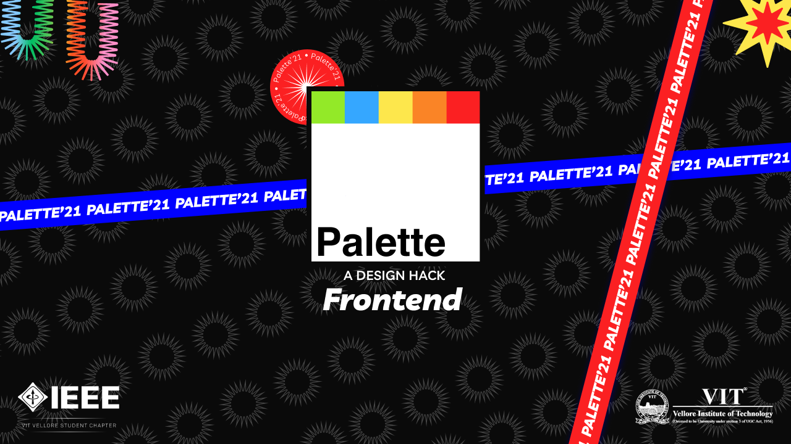

# Palette 2021 Frontend



## About

Palette 2021 Frontend, This project was to create a frontend that ensures a smooth functioning for participants of Palette 21.<br/>
Participants can register and log in either via their Google or Figma accounts.
You can create a team or join an existing one. After registering, you can send invites to other participants who are looking for a teammate. The participant who received the invite can either accept or reject an invite.<br/>
Once the registration deadline passes, new users cannot register. Once the team formation deadline passes, you cannot change your team.<br/>
Each team can generate up to 3 new random problem statements. You and your teammate can either lock individual parts of the problem statement or the entire one at once. Once the three tries are over, your last generated problem statement is locked if you haven't locked one before it.<br/>
Each team has to submit their submission for the first round before the deadline passes. You can edit your submission as many times as you want. Once the deadline passes and the judges have released the qualified teams, the next round begins and only the qualified teams can make updates to their previous submissions accordingly for the next round.<br/>

## Tools and Technology Used

- HTML
- CSS
- JavaScript
- React.js
- Bootstrap
- MaterialUI
- CloudFlare Pages for hosting

## Getting Started

To get started:

-   Clone the repo.
    `git clone https://github.com/IEEE-VIT/Palette-Frontend-21.git`
-   Checkout to a new branch.
    `git checkout -b my-amazing-feature`
-   Make some amazing changes.
-   `git add .`
-   `git commit -m "A short description about the feature."`
-   `git push origin my-amazing-feature`
-   Open a pull request :)

*   For running this project successfully you'll need to create a `.env` file and store your firebase credentials there like following

```
REACT_APP_BACKEND_API=<BACKEND URL with /v1/ appended>
REACT_APP_BACKEND_URL=<BACKEND URL>
REACT_APP_OAUTH_URL=<FRONTEND URL>
REACT_APP_FIGMA_CALLBACK=<URL OF SUCCESSFUL AUTH PAGE HOSTED>
REACT_APP_SITE_KEY=<RECAPTCHA KEY>
```

To start contributing, check out [`CONTRIBUTING.md`](https://github.com/IEEE-VIT/Palette-Frontend-21/blob/main/CONTRIBUTING.md) . New contributors are always welcome to support this project.


### Development Run

```shell
yarn install
yarn start
```

### Production Run

```shell
yarn install
yarn start
```

## Contributors ✨

<table>
	<tr>
    <td align="center">
    		<a href="https://github.com/r-ush"><br /><sub><b>Aarush Bhat</b></sub></a>
    	</td>
    <td align="center">
    		<a href="https://github.com/agnivabasak"><br /><sub><b>Agniva Basak</b></sub></a>
    	</td>
    <td align="center">
			<a href="https://github.com/DarthBenro008"><br /><sub><b>Hemanth Krishna</b></sub></a>
		</td>
    <td align="center">
			<a href="https://github.com/CyberneTech"><br /><sub><b>Shruti Jain</b></sub></a>
		</td>
    <td align="center">
			<a href="https://github.com/ShubhamPalriwala"><br /><sub><b>Shubham Palriwala</b></sub></a>
		</td>
		<td align="center">
			<a href="https://github.com/souris-dev"><br /><sub><b>Souris Ash</b></sub></a>
		</td>
    	<td align="center">
    		<a href="https://github.com/Srish-tii"><br /><sub><b>Srishti Lodha</b></sub></a>
    	</td>
    </tr>

</table>

<br />

<p align="center">Made with ❤ by IEEE-VIT</p>
